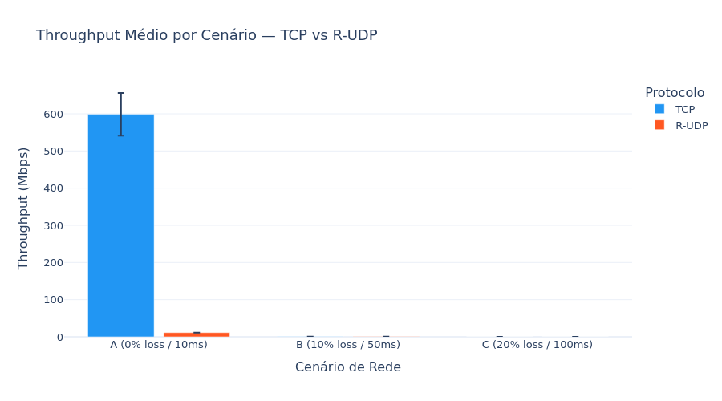
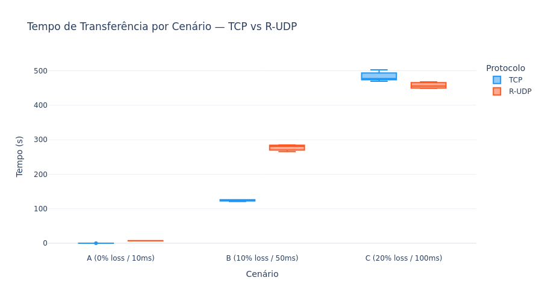
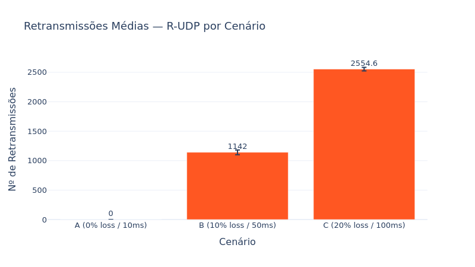
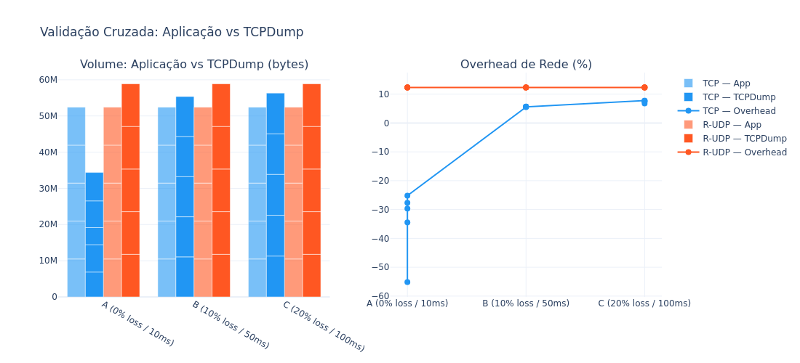
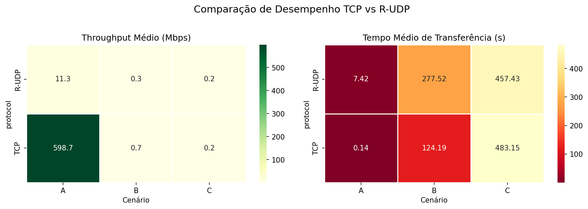

# Análise Comparativa TCP vs R-UDP em Ambientes com Degradação de Rede

> **PPGCC/UFPI — Projeto de Redes de Computadores 2026-1**  
> Matrícula: 20261005083 | Luiz Nelson dos Santos Lima


---

## Resumo

Este projeto implementa e avalia comparativamente dois protocolos de transferência de arquivos — **TCP nativo** e **R-UDP (Reliable UDP com Selective Repeat)** — sobre uma rede emulada com três cenários de degradação crescente (perda de pacotes e latência). Os experimentos são executados em containers Docker isolados. O tráfego é inspecionado com `tcpdump` e os resultados são confrontados com as métricas registradas pela própria aplicação (validação cruzada). A análise estatística é gerada automaticamente com Plotly e Seaborn.

---

## Estrutura do Repositório

```
redes-ppgcc-fase1/
│
├── src/                        # Código-fonte principal
│   ├── config.py               # Parâmetros globais: portas, janela SR, matrícula
│   ├── server.py               # Servidor TCP + R-UDP (Selective Repeat)
│   └── client.py               # Cliente TCP + R-UDP com coleta de métricas
│
├── docker/                     # Ambiente de execução isolado
│   ├── Dockerfile.node         # Imagem Ubuntu com Python, tc, tcpdump
│   └── docker-compose.yml      # Rede bridge 172.20.0.0/24, dois containers
│
├── scripts/                    # Automação dos experimentos
│   ├── run_tests.sh            # Orquestra cenários, tc, tcpdump e transferências
│   ├── pcap_to_csv.py          # Converte capturas .pcap → .csv via Scapy
│   ├── gen_testfile.sh         # Gera arquivo binário aleatório para os testes
│   └── verify_auth.sh          # Verifica presença do X-Custom-Auth no tráfego
│
├── analysis/
│   ├── analysis.py             # Geração de gráficos e validação cruzada (local)
│   └── analysis_colab.ipynb    # Notebook idêntico para execução no Google Colab
│
├── data/                       # Saídas dos experimentos (geradas ao rodar)
│   ├── logs/                   # Métricas JSONL registradas pela aplicação
│   ├── pcap/                   # Capturas brutas .pcap (excluídas do git — grandes)
│   ├── csv/                    # CSVs exportados do tcpdump por cenário/repetição
│   └── plots/                  # Gráficos PNG e HTML gerados pela análise
│
├── run_all.sh                  # Pipeline completo: build → testes → análise
├── requirements.txt            # Dependências Python para análise
└── .gitignore
```

---

## Implementação

### Arquitetura

```
┌─────────────────────────────────────────────────────────┐
│  Rede Docker Bridge  172.20.0.0/24                      │
│                                                         │
│  ┌──────────────────┐   tc netem    ┌────────────────┐  │
│  │  ppgcc_client    │ ←────────────→│  ppgcc_server  │  │
│  │  172.20.0.20     │  delay + loss │  172.20.0.10   │  │
│  │                  │               │                │  │
│  │  client.py       │  TCP :5001    │  server.py     │  │
│  │  Selective       │  R-UDP :5002  │  TCP + R-UDP   │  │
│  │  Repeat Sender   │               │  SR Receiver   │  │
│  │                  │               │                │  │
│  │  tcpdump ──────────────────────────────────────── │  │
│  └──────────────────┘               └────────────────┘  │
└─────────────────────────────────────────────────────────┘
```

### Protocolo R-UDP — Selective Repeat

O R-UDP implementado garante entrega confiável sobre UDP com os seguintes mecanismos:

**Formato do pacote (cabeçalho de 21 bytes):**
```
┌────────────┬──────────┬──────────────────┬──────────────────────┐
│  seq (4B)  │ flags(1B)│  checksum MD5(16B)│  payload (≤ 1024B)  │
└────────────┴──────────┴──────────────────┴──────────────────────┘
```

| Flag | Valor | Uso |
|------|-------|-----|
| DATA | 0x01  | Pacote de dados |
| ACK  | 0x02  | Confirmação positiva (entrega OK) |
| FIN  | 0x04  | Sinalização de fim de transferência |
| NACK | 0x08  | Confirmação negativa (checksum falhou → retransmissão imediata) |

**Mecanismo Selective Repeat:**

| Parâmetro     | Valor | Descrição |
|---------------|-------|-----------|
| `WINDOW_SIZE` | 16    | Máximo de pacotes não confirmados simultaneamente |
| `CHUNK_SIZE`  | 1024B | Tamanho de cada bloco de dados |
| `TIMEOUT_SEC` | 0.5s  | Tempo limite individual por pacote |
| `MAX_RETRIES` | 20    | Tentativas máximas antes de abortar |

O sender mantém uma janela deslizante e retransmite **apenas o pacote** cujo timer expirou ou cujo NACK foi recebido — nunca toda a janela (diferença fundamental em relação ao Go-Back-N). O receiver usa um buffer para aceitar pacotes fora de ordem e entregá-los em sequência.

O campo `X-Custom-Auth: 20261005083:Luiz Nelson dos Santos Lima` é enviado no payload de metadados (seq=0) de toda transferência, visível em texto plano no tcpdump.

### Simulação de Rede (`tc netem`)

Os cenários são aplicados no container cliente com `tc qdisc netem` antes de cada rodada:

| Cenário | Perda de Pacotes | Delay RTT  | Objetivo |
|---------|-----------------|-----------|----------|
| A       | 0%              | 10 ms     | Linha base — rede ideal |
| B       | 10%             | 50 ms     | Rede com degradação moderada |
| C       | 20%             | 100 ms    | Rede com degradação severa |

### Validação Cruzada

A "prova real" do projeto: confrontar o que a aplicação mediu com o que o `tcpdump` capturou na interface de rede.

```
Aplicação Python          tcpdump (.pcap → .csv)
─────────────────         ──────────────────────
bytes_sent          ←──→  soma de length (bytes)
elapsed_sec         ←──→  timestamp_max - timestamp_min
throughput_mbps     ←──→  bytes × 8 / duração / 1e6
```

A diferença percentual `(tcpdump_bytes - app_bytes) / app_bytes` revela o overhead real de protocolo (cabeçalhos IP, TCP/UDP, retransmissões).

---

## Reprodução dos Experimentos

### Pré-requisitos

- Docker Engine + Docker Compose v2
- Python 3.10+
- WSL2 (se Windows) ou Linux nativo

```bash
docker compose version   # deve ser >= 2.x
python3 --version        # deve ser >= 3.10
```

> **Nota WSL2:** se aparecer `open /proc/sys/net/core/rmem_max: no such file or directory`
> ao subir os containers, execute antes:
> ```bash
> sudo sysctl -w net.core.rmem_max=26214400
> sudo sysctl -w net.core.wmem_max=26214400
> ```

---

### Opção A — Pipeline completo (recomendado)

Um único comando faz build, testes, cópia dos dados e geração dos gráficos:

```bash
chmod +x run_all.sh
./run_all.sh both 10 5
#             │    │  └─ repetições por cenário (5 → desvio padrão real)
#             │    └──── tamanho do arquivo de teste (MB)
#             └───────── modo: tcp | rudp | both
```

Tempo estimado: **~35–50 min** (cenário C R-UDP domina por causa das retransmissões).

---

### Opção B — Passo a passo manual

**1. Confirmar pasta correta**
```bash
ls
# Deve mostrar: src  docker  scripts  analysis  data  README.md
```

**2. Build e subida dos containers**
```bash
cd docker
docker compose build
docker compose up -d
docker compose ps
# ppgcc_server e ppgcc_client devem aparecer com status "Up"
```

**3. Entrar no container cliente e rodar os testes**
```bash
docker exec -it ppgcc_client bash

# Dentro do container:
chmod +x /scripts/run_tests.sh
/scripts/run_tests.sh both 10 5
```

O script executa para cada repetição de cada cenário:
1. Aplica `tc qdisc netem` com os parâmetros do cenário
2. Inicia captura `tcpdump` em background → salva em `/data/pcap/`
3. Executa `client.py` (TCP e/ou R-UDP) → métricas salvas em `/data/logs/`
4. Para o `tcpdump` e converte `.pcap` → `.csv` via Scapy

**4. Copiar os dados para o host**
```bash
exit        # sai do container
cd ..       # volta para a raiz do projeto
docker cp ppgcc_client:/data .
```

**5. Instalar dependências e gerar os gráficos**
```bash
pip3 install -r requirements.txt --break-system-packages
LOG_DIR=data/logs CSV_DIR=data/csv PLOTS_DIR=data/plots python3 analysis/analysis.py
```

**6. Verificar X-Custom-Auth no tráfego (opcional)**

Em um segundo terminal, durante a execução dos testes:
```bash
docker exec ppgcc_client tcpdump -i eth0 -A -s 0 'port 5001' 2>/dev/null \
    | grep --line-buffered "X-Custom-Auth"
# Saída esperada: "X-Custom-Auth": "20261005083:Luiz Nelson dos Santos Lima"
```

---

## Resultados e Análise

### Throughput médio ± desvio padrão



### Tempo de transferência por cenário



### Retransmissões R-UDP por cenário



### Validação cruzada — Aplicação vs TCPDump



### Heatmap comparativo



**Métricas coletadas:**

| Métrica | Fonte | Cálculo |
|---------|-------|---------|
| Throughput (Mbps) | Aplicação | `bytes × 8 / elapsed / 1e6` |
| Tempo de transferência (s) | Aplicação | `time.perf_counter()` início → fim |
| Retransmissões | Aplicação (R-UDP) | Contador de timeouts + NACKs |
| Bytes na rede | tcpdump / CSV | Soma do campo `length` por captura |
| Overhead de protocolo (%) | Cruzamento | `(tcpdump_bytes − app_bytes) / app_bytes × 100` |

---

## Notebook de Análise

O notebook [`analysis/analysis_colab.ipynb`](analysis/analysis_colab.ipynb) reproduz todos os gráficos do relatório e pode ser executado localmente (Jupyter/Anaconda) ou visualizado diretamente no GitHub.

**Execução local:**
```bash
pip install -r requirements.txt
jupyter notebook analysis/analysis_colab.ipynb
```

> Os gráficos gerados são **idênticos** aos do relatório SBC (mesmas funções, mesmos parâmetros visuais). Os arquivos HTML interativos ficam em `data/plots/`.

---

## Estrutura do Código

### `src/config.py`
Único ponto de configuração do projeto. Centraliza matrícula, portas TCP/UDP, parâmetros do Selective Repeat e caminhos de log. **Altere aqui se precisar ajustar a janela ou timeout.**

### `src/server.py`
Servidor dual-mode (TCP + R-UDP) com duas classes independentes:
- `TCPServer` — aceita conexões, recebe arquivo via stream, registra métricas em `tcp_metrics.jsonl`
- `RUDPServer` — receiver Selective Repeat síncrono; o loop principal bloqueia durante cada transferência para evitar race condition no socket UDP compartilhado

### `src/client.py`
Cliente dual-mode com:
- `send_tcp()` — transferência TCP com coleta de throughput e tempo do lado cliente
- `SelectiveRepeatSender` — implementação completa do sender SR com janela deslizante, thread receptora de ACKs, retransmissão por timeout e por NACK, registro de retransmissões
- `generate_test_file()` — gera o arquivo de teste em `/tmp/testfile.bin` se não existir

### `scripts/run_tests.sh`
Orquestrador dos experimentos. Aceita `[mode] [filesize_mb] [repetitions]`.  
Para cada cenário × repetição: aplica `tc`, dispara `tcpdump`, executa `client.py`, para o `tcpdump` e converte `.pcap → .csv`. Todos os arquivos são nomeados com `_rep{N}` para permitir cálculo de desvio padrão.

### `scripts/pcap_to_csv.py`
Converte capturas `.pcap` para CSV com campos: `timestamp`, `src_ip`, `dst_ip`, `protocol`, `src_port`, `dst_port`, `length`, `tcp_flags`, `tcp_seq`, `tcp_ack`, `payload_size`. Usado internamente pelo `run_tests.sh`.

### `analysis/analysis.py`
Lê os `.jsonl` de métricas e os `.csv` do tcpdump. Gera 5 visualizações (Plotly interativo + PNG via Seaborn/Matplotlib). Suporta dados sintéticos para demonstração quando os experimentos ainda não foram executados.

---

## Dependências

```
Python >= 3.10
Docker Compose >= 2.x
```

Pacotes Python (análise, host):
```bash
pip3 install -r requirements.txt --break-system-packages
```

Pacotes Python (container Docker — instalados automaticamente pelo `Dockerfile.node`):
```
python3, scapy, plotly, seaborn, pandas, matplotlib, numpy
```

---

## Referência

```
LIMA, Luiz Nelson dos Santos.
Análise Comparativa TCP vs R-UDP em Ambientes com Degradação de Rede.
Projeto de Redes de Computadores — PPGCC/UFPI, 2026-1.
Disponível em: https://github.com/luizznelson/redes-ppgcc-tf-fase1
```

---

**Repositório:** https://github.com/luizznelson/redes-ppgcc-tf-fase1
